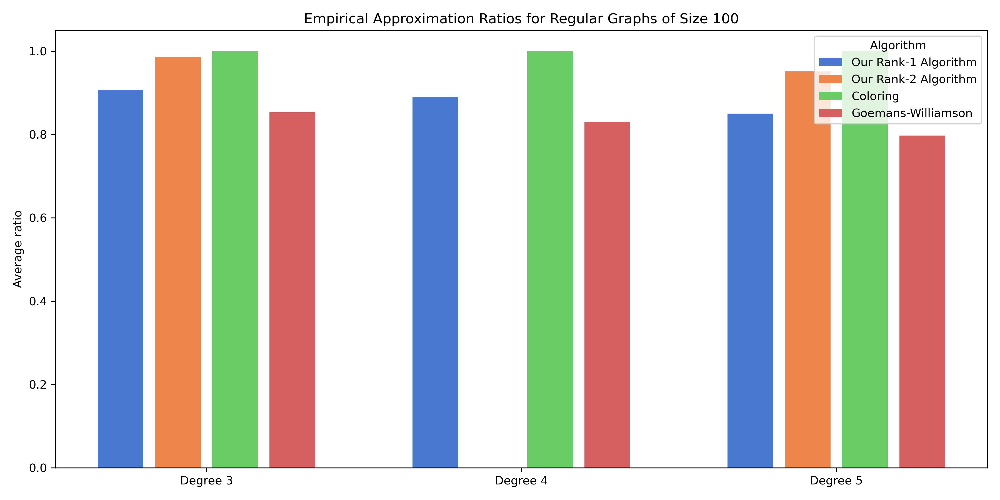
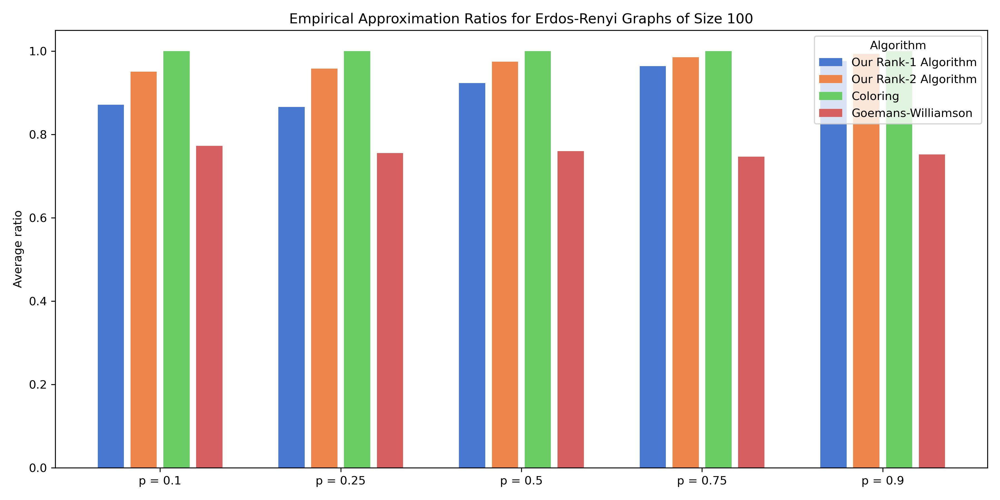
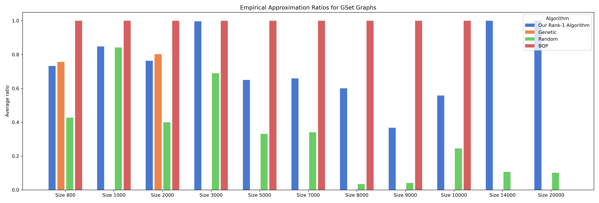

<p align="center">
  <h1 align="center">Low-Rank Max-<em>K</em>-Cut</h1>
  <p align="center">
    <strong>GPU-parallel solver exploiting low-rank structure in discrete quadratic maximization</strong>
  </p>
  <p align="center">
    <a href="https://arxiv.org/abs/2602.20376"></a>
    <a href="https://akyrillidis.github.io/explore-quantum/MaxKCut.html"></a>
    <a href="https://akyrillidis.github.io/explore-quantum/LowRankMaxCut_GPU.html"></a>
    <a href="https://akyrillidis.github.io/explore-quantum/LowRankMaxCut_Rank1.html"></a>
    <a href="https://akyrillidis.github.io/explore-quantum/LowRankMaxCut_RandR2.html"></a>
    <a href="https://akyrillidis.github.io/explore-quantum/LowRankMaxCut_DSatur.html"></a>
    <a href="https://www.python.org/"></a>
    <a href="https://pytorch.org/"></a>
    <a href="https://developer.nvidia.com/cuda-toolkit"></a>
  </p>
</p>

---

Given a positive semidefinite matrix **Q**, we solve the discrete quadratic maximization

$$\max_{\mathbf{z} \in \mathcal{A}_K^n} \; \mathbf{z}^\dagger \mathbf{Q} \, \mathbf{z}, \qquad \mathcal{A}_K = \big\lbrace e^{2\pi i k / K} : k = 0,\ldots,K{-}1 \big\rbrace$$

by approximating **Q** with its top-*r* eigenvectors and enumerating a polynomial-sized candidate set that is guaranteed to contain the global maximizer. For *K* = 3 this is exactly the **Max-3-Cut** problem. The candidate evaluations are independent, making the algorithm **embarrassingly parallel** across GPUs.

<p align="center">
  
  
</p>
<p align="center"><em>Empirical approximation ratios on 5-regular (left) and Erdős-Rényi (right) graphs with n=100 nodes.</em></p>

## ✨ Key Features

- **Exact for low-rank objectives** — the candidate set provably contains the global maximizer when rank(**Q**) = *r*
- **Embarrassingly parallel** — scales linearly with GPU count; tested on 1–15 GPUs across heterogeneous clusters
- **No tensor cores required** — runs on any CUDA GPU from Pascal (2016) onward, including PowerPC systems
- **Theoretical guarantees** — multiplicative approximation ratio for perturbed low-rank matrices (Theorems 4.1–4.2)
- **Multiple GPU paths** — Ray-based single-node solver and Ray-free `worker.py` for cross-machine distribution
- **Rank-1 at extreme scale** — incremental scoring solves million-node graphs on a single CPU; 2-eigenvector complex rounding for K=3
- **Hybrid solver** — rank-1 warm-start + greedy local search beats greedy on 100% of 45 tested instances (n=10K to 1M)
- **Randomized rank-2 (R2G)** — 3-phase pipeline (eigensolve → rank-2 sampling → greedy) beats SA on 6/12 graph families; constant sample complexity in n
- **CPU sparse solver** — scales rank-2 to n=1.4M on commodity CPUs via Laplacian fast-path scoring
- **Baseline suite** — incremental greedy, simulated annealing, tabu search, SDP (cvxpy) for fair comparison

## 🚀 Quick Start

### Prerequisites

```bash
pip install torch numpy scipy ray
# Optional: pip install cvxpy   (for SDP baselines)
```

### Rank-1 Solve (single node)

```bash
python src/parallel_rank_1_gpu.py \
    --q_path data/Q.npy --v_path data/V.npy \
    --K 3 --num_gpus 4 --precision 32
```

### Rank-2 Solve — Single Node (Ray)

```bash
ray start --head --num-gpus=4
python src/parallel_rank_r_dir_gpu_fullgpu.py \
    --qv_dir data/ --results_dir results/ \
    --rank 2 --K 3 --candidates_per_task 100000000
```

### Rank-2 Solve — Multi-Machine (Ray-free)

```bash
# On each machine, run worker.py with its assigned range:
python src/worker.py \
    --q_path data/Q.npy --v_path data/V.npy \
    --vtilde_path data/Vtilde.npy \
    --start_rank 0 --end_rank 1000000 \
    --rank 2 --K 3 --num_gpus 4 \
    --out results/result.json
```

### Generate Graph Instances

```bash
# 5-regular graph
python src/graph_generators/gen_regular_random.py --n 500 --degree 5 --rank 2 --seed 42

# Stochastic block model
python src/graph_generators/gen_sbm.py --n 500 --blocks 3 --prob_within 0.3 --prob_between 0.01

# Toroidal grid
python src/graph_generators/gen_torus.py --n 500 --rank 2

# All families at once (for experiments)
python src/graph_generators/gen_all_instances.py --base_dir instances/ --sizes 250,500,1000
```

### Load Real-World Graphs

```bash
# Download and process Delaunay meshes from SuiteSparse
python src/graph_generators/gen_from_mtx.py --datasets delaunay_n13,delaunay_n16 --data_dir realworld_data/

# List available datasets
python src/graph_generators/gen_from_mtx.py --list
```

### Rank-1 with Incremental Scoring + Hybrid

```bash
# Rank-1 alone (O(n·degree), scales to n=1M)
python src/hybrid.py --q_path data/Q.npy --v_path data/V.npy --K 3

# Hybrid: Rank-1 warm-start + Greedy local search
python src/hybrid.py --q_path data/Q.npy --v_path data/V.npy --K 3 --greedy_seeds 0,1,2
```

### Run Baselines

```bash
python src/baselines.py --q_path data/Q.npy --K 3 --methods random,greedy,sdp
```

## 📁 Repository Structure

```
├── src/
│   ├── parallel_rank_r_dir_gpu_fullgpu.py   # Main GPU solver (Ray, rank-r recursive)
│   ├── parallel_rank_1_gpu.py               # GPU rank-1 solver
│   ├── hybrid.py                            # Rank-1 incremental + hybrid warm-start solver
│   ├── worker.py                            # Ray-free multi-GPU worker
│   ├── coordinator.py                       # SSH-based cross-machine orchestrator
│   ├── baselines.py                         # Greedy, SA, Tabu, SDP, Random (all incremental)
│   ├── randomized_rank_r_gpu.py             # GPU randomized rank-r (~820K cand/s per P100)
│   ├── randomized_rank_r_cpu_sparse.py      # CPU sparse solver for n≥50K (Laplacian fast-path)
│   ├── randomized_rank_r.py                 # CPU reference randomized solver
│   ├── utils.py                             # Core math: V_tilde, intersections, scoring
│   ├── graph_generators/                    # Graph instance generators
│   │   ├── gen_from_mtx.py                  # Load SuiteSparse/SNAP real-world graphs
│   │   ├── gen_all_instances.py             # Batch synthetic generator with diagnostics
│   │   └── ...                              # ER, regular, SBM, torus generators
│   └── post_process/                        # Result aggregation scripts
├── experiments/
│   ├── multi_node_rank_r_dir_gpu_fullgpu.sh # SLURM launch script
│   ├── bench_incremental.py                 # Incremental scoring benchmark (n=10K to 1M)
│   ├── run_extreme_scale.py                 # Extreme-scale comparison (all methods)
│   ├── run_realworld_experiments.py          # Real-world graph experiments
│   ├── run_hybrid_extreme.py                # Hybrid vs Greedy at extreme scale
│   └── generate_graphs/                     # Graph generation shell scripts
├── gset/                                    # GSet benchmark graphs (G1–G81)
├── results/                                 # Precomputed results (H200, GSet)
├── summaries/                               # Paper figures and result summaries
├── read_only/                               # Original reference implementations
└── requirements.txt
```

## 💻 Hardware

| Hardware | Rank-2 Frontier | Notes |
|----------|----------------|-------|
| 1 × P100 (16 GB) | n ≈ 500 | Minimum viable setup |
| 4 × P100 | n ≈ 1,000 | Single-node Ray |
| 15 × P100 (4 machines) | n ≈ 1,500 | Multi-machine worker.py |
| 8 × H200 (80 GB) | n ≈ 3,600 | Single-node, 18.3 hours |

No tensor cores, BF16, or Triton support required. The algorithm uses standard FP32 GEMM and `torch.linalg.solve`.

### Randomized Rank-2 + Greedy (R2G)

```bash
# GPU randomized rank-2 (for n ≤ 10K, requires GPU)
python src/randomized_rank_r_gpu.py \
    --q_path data/Q.npy --v_path data/V.npy \
    --rank 2 --K 3 --max_samples 1000000 --num_gpus 4 --seed 0 \
    --out result.json

# CPU sparse randomized rank-2 (for n ≥ 50K, no GPU needed)
python src/randomized_rank_r_cpu_sparse.py \
    --q_path data/L.npz --v_path data/V.npy \
    --rank 2 --K 3 --max_samples 1000000 --num_workers 16 --seed 0 \
    --out result.json

# Then warm-start greedy from the rank-2 partition:
python -c "
import json, numpy as np
from scipy import sparse
from baselines import greedy_cut_incremental
L = sparse.load_npz('data/L.npz')
r2 = json.load(open('result.json'))
score, z, t, iters = greedy_cut_incremental(L, K=3, init_k=r2['best_k'])
print(f'R2G score: {score}')
"
```

The CPU sparse solver auto-detects Laplacian structure and uses the fast-path formula `z†Lz = 3·|cut edges|` for K=3. Memory-aware batch sizing caps the projection buffer at ~1 GB per worker.

### R2G Results — Beats SA on 6/12 Graph Families

| Graph Family | R2G vs SA | R2G vs Hybrid | Graph Type |
|-------------|----------|--------------|------------|
| **soc-Epinions1** | **+1.96%** | +1.25% | Social trust |
| **web-Google** | **+1.90%** | +0.08% | Web graph |
| **Torus** | **+1.58%** | tied | Structured |
| **email-Enron** | **+0.19%** | +0.00% | Social |
| **amazon0601** | **+0.12%** | +0.16% | Product |
| **loc-Brightkite** | **+0.06%** | +0.26% | Location-social |
| com-DBLP | −0.10% | +0.45% | Collaboration |
| Road networks | −0.64% | +0.10% | Spatial |
| Delaunay meshes | −2.05% | +0.37% | Geometric |
| Erdős–Rényi | −2.16% | +0.14% | Random |
| Regular (5-reg) | −4.15% | −3.21% | Synthetic |

## 📊 Results Highlights

<p align="center">
  
</p>
<p align="center"><em>Performance on GSet benchmark instances (up to 20,000 nodes for rank-1).</em></p>

| Graph Family | Rank-2 vs SDP | Rank-2 vs Greedy | Speed (15 P100s) |
|-------------|--------------|-----------------|------------------|
| **Torus** | Matches exactly | Beats by 3–5% | 1.5–3× faster than SDP |
| **5-Regular** | Beats at n ≥ 1000 | Comparable | 1.5–3× faster than SDP |
| **SBM** | Comparable | Greedy wins | Faster than SDP |

### Rank-1 at Extreme Scale

| n | Sweep Time | Total (incl. eigsh) |
|---|---|---|
| 10,000 | 0.12s | **0.3s** |
| 100,000 | 1.3s | **7s** |
| 500,000 | 6.2s | **2 min** |
| 1,000,000 | 13s | **5 min** |

### Hybrid (Rank-1 + Greedy) — 45 Instances

| Graph Family | n range | Hybrid vs Greedy | SA vs Hybrid | SA slowdown vs Hybrid |
|-------------|---------|-----------------|-------------|----------------------|
| **Torus** | 10K–1M | **+3.9%** | SA loses by 0.5–2.1% | 3–64× slower |
| **5-Regular** | 10K–100K | **+3.3%** | SA wins by 0.9–1.1% | 26–53× slower |
| **5-Regular** | 500K–1M | **+3.3%** | SA loses by 0.6–1.1% | 9× slower |
| **Erdős–Rényi** | 10K–100K | **+1.1%** | SA wins by 2.1–2.4% | 71–84× slower |
| **Delaunay** | 1K–524K | **+0.4–1.1%** | SA wins by 2.5–5.0% | 19–467× slower |
| **Road networks** | 1M+ | **+0.3–0.8%** | SA wins by 0.9–1.2% | 6–9× slower |

Hybrid beats greedy on **100%** of instances (45/45). On structured graphs (torus), rank-1 alone is the best method. Where SA wins on score, it requires 9–467× more wall-clock time than Hybrid.

## 📝 Citation

```bibtex
@article{Stevens2025maxkcut,
  title   = {Exploiting Low-Rank Structure in Max-$K$-Cut Problems},
  author  = {Stevens, Ria and Liao, Fangshuo and Su, Barbara
             and Li, Jianqiang and Kyrillidis, Anastasios},
  journal = {arXiv preprint arXiv:2602.20376},
  year    = {2025}
}
```

## 📖 Blog Posts

- 📘 [Exploiting Low-Rank Structure in Max-K-Cut Problems](https://akyrillidis.github.io/explore-quantum/MaxKCut.html) — Algorithm overview, theory, and benchmark results
- 🖥️ [What Can 15 Obsolete GPUs Do for Combinatorial Optimization?](https://akyrillidis.github.io/explore-quantum/LowRankMaxCut_GPU.html) — GPU implementation, scaling experiments, and interactive visualizations
- 🧱 [Rank-1 as a Building Block for Million-Node Max-3-Cut](https://akyrillidis.github.io/explore-quantum/LowRankMaxCut_Rank1.html) — Incremental scoring, hybrid warm-starts, extreme-scale experiments
- 🎲 [Randomized Rank-2: When Two Eigenvectors Beat One](https://akyrillidis.github.io/explore-quantum/LowRankMaxCut_RandR2.html) — 3-phase pipeline beats SA on 6/12 graph families; constant sample complexity
- 🔀 [Spectral vs. Combinatorial: Two Views of Graph Structure](https://akyrillidis.github.io/explore-quantum/LowRankMaxCut_DSatur.html) — DSatur + spectral ensemble beats SA on 11/13 families

## 👥 Authors

[Ria Stevens](mailto:ria.stevens@rice.edu), [Fangshuo Liao](mailto:fangshuo.liao@rice.edu), [Barbara Su](mailto:barbara.su@rice.edu), [Jianqiang Li](mailto:jl567@rice.edu), [Anastasios Kyrillidis](mailto:anastasios@rice.edu)

**Rice University**, Department of Computer Science

## 📄 License

MIT
